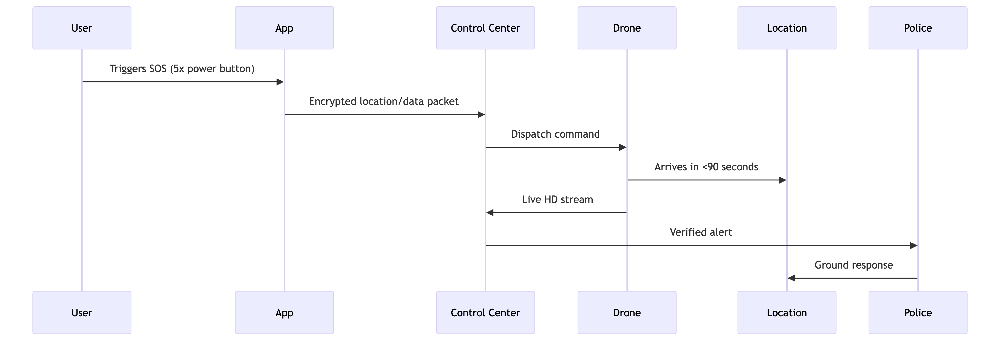
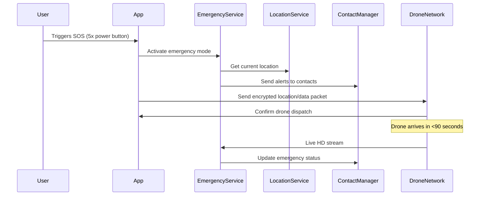

# HelpNet - AI-Powered Emergency Response System 🚨

[](https://android.com/)
[](https://kotlinlang.org/)
[](https://android-arsenal.com/api?level=24)
[](#legal-notice)

> **Next-Generation Emergency Assistance** - Revolutionizing emergency response through mobile technology and autonomous drone integration.



## 📑 Table of Contents

- [Overview](#overview)
- [🚀 Key Features](#-key-features)
- [📱 Screenshots](#-screenshots)
- [🛠️ Installation & Setup](#️-installation--setup)
- [📖 Usage Guide](#-usage-guide)
- [🏗️ Technical Architecture](#️-technical-architecture)
- [🔧 Development](#-development)
- [📚 API Documentation](#-api-documentation)
- [🤝 Contributing](#-contributing)
- [📜 Legal Notice](#-legal-notice)
- [📞 Contact](#-contact)

## Overview

HelpNet revolutionizes emergency response through mobile technology and autonomous drone integration. Our patented system provides instant assistance when seconds matter most, featuring AI-powered drone dispatch, real-time location sharing, and intelligent emergency mapping.

### 🎯 Mission
To create a comprehensive emergency response ecosystem that reduces response times from minutes to seconds through cutting-edge technology integration.

## 🚀 Key Features

### 📱 Smart SOS System
- **5x Power Button Activation** - Discreet emergency trigger mechanism
- **AI-Powered Drone Dispatch** - Autonomous police drones deployed upon activation
- **Real-Time Location Sharing** - Precise GPS coordinates sent to authorities instantly
- **Background Emergency Service** - Continuous monitoring and protection

### 🚁 Integrated Drone Response (Patent Pending)
- **60-Second Average Response Time** - Drones reach locations faster than ground units
- **Live HD Video Streaming** - Real-time situational awareness for first responders
- **Crime Deterrent Features:**
  - 120dB Emergency Siren
  - Voice warnings and alerts
  - High-intensity strobe lighting
  - Facial recognition capabilities

### 🗺️ Intelligent Emergency Mapping
- **3D Threat Visualization** - AI-processed aerial footage analysis
- **Hotspot Prediction** - Machine learning identifies high-risk areas
- **Swarm Coordination** - Multiple drones for large-scale incidents
- **Real-time Emergency Network** - Community-wide alert system

### 📹 Evidence Preservation
- **Automatic Recording** - 30-second pre-SOS buffer recording
- **Blockchain-Verified Storage** - Tamper-proof evidence chain
- **Smart Redaction** - Automatic blurring of bystanders for privacy
- **Secure File Sharing** - Encrypted evidence transmission

### 👥 Emergency Contacts Management
- **Quick Contact Setup** - Easy emergency contact configuration
- **Automated Alerts** - Instant SMS and call notifications
- **Location Sharing** - Real-time location updates to trusted contacts
- **Medical Information** - Critical health data for first responders

## 📱 Screenshots

*Screenshots will be added as the app UI is finalized*

## 🛠️ Installation & Setup

### Prerequisites
- Android Studio Arctic Fox (2020.3.1) or later
- Android SDK API 24 or higher
- Kotlin 1.8+
- Google Play Services

### Development Setup

1. **Clone the repository**
   ```bash
   git clone https://github.com/Nirajlpu/helpnet-sos-app.git
   cd helpnet-sos-app
   ```

2. **Open in Android Studio**
   - Launch Android Studio
   - Select "Open an existing project"
   - Navigate to the cloned repository folder

3. **Configure dependencies**
   ```bash
   ./gradlew clean build
   ```

4. **Set up Google Services** (Required for Maps and Location)
   - Obtain a Google Maps API key from [Google Cloud Console](https://console.cloud.google.com/)
   - Add your API key to `local.properties`:
     ```properties
     MAPS_API_KEY=your_api_key_here
     ```

5. **Run the application**
   - Connect an Android device or start an emulator
   - Click "Run" or use `Shift + F10`

### Required Permissions

The app requires the following permissions for full functionality:

- **Location**: `ACCESS_FINE_LOCATION`, `ACCESS_COARSE_LOCATION`, `ACCESS_BACKGROUND_LOCATION`
- **Communication**: `CALL_PHONE`, `SEND_SMS`, `READ_CONTACTS`
- **Media**: `CAMERA`, `RECORD_AUDIO`, `READ_EXTERNAL_STORAGE`
- **System**: `VIBRATE`, `POST_NOTIFICATIONS`, `USE_FULL_SCREEN_INTENT`

## 📖 Usage Guide

### Initial Setup
1. **Download and install** HelpNet from the Google Play Store
2. **Grant permissions** when prompted (all permissions are essential for emergency features)
3. **Set up emergency contacts** in the app settings
4. **Configure personal information** including medical details if relevant

### Emergency Activation

#### Method 1: 5x Power Button
1. Press the power button **5 times rapidly**
2. The app will automatically activate emergency mode
3. Location, audio, and video recording begin immediately
4. Emergency contacts and authorities are notified

#### Method 2: App Interface
1. Open the HelpNet app
2. Tap the large red **SOS button**
3. Confirm the emergency activation
4. Emergency protocols activate immediately

### Features Navigation

- **🏠 Home**: Main dashboard with SOS activation
- **📞 Emergency Contacts**: Manage trusted contacts
- **🗺️ Nearby Help**: Find nearby emergency services
- **👤 Profile**: Personal information and settings

## 🏗️ Technical Architecture

### Mobile Application Stack

```
┌─────────────────────────────────────┐
│            User Interface           │
│        (Kotlin + ViewBinding)       │
├─────────────────────────────────────┤
│         Business Logic              │
│    (Emergency Services & Managers)  │
├─────────────────────────────────────┤
│          Data Layer                 │
│  (Location, Contacts, File Storage) │
├─────────────────────────────────────┤
│        System Integration           │
│   (Camera, SMS, Notifications)      │
└─────────────────────────────────────┘
```

### Core Components

| Component | Description | Technology |
|-----------|-------------|------------|
| **MainActivity** | Primary app interface and SOS trigger | Kotlin, ViewBinding |
| **EmergencyService** | Background emergency monitoring | Foreground Service |
| **LocationManager** | GPS tracking and sharing | Google Location Services |
| **MediaManager** | Video/audio recording | Camera2 API |
| **NotificationManager** | Emergency alerts and updates | NotificationCompat |
| **ContactsManager** | Emergency contact management | ContactsContract |

### Technical Specifications

#### Mobile Component
- **Platform**: Android API 24+ (Android 7.0+)
- **Language**: Kotlin with Java interoperability
- **Architecture**: MVVM with ViewBinding
- **Location Services**: GPS + GLONASS + Galileo
- **Security**: End-to-end encrypted communications
- **Storage**: Local SQLite + Encrypted SharedPreferences

#### Drone Network (Conceptual)
- **Range**: 8km radius per station
- **Flight Time**: 45 minutes (swappable batteries)
- **Sensors**:
  - 4K/60fps stabilized camera
  - Thermal imaging capabilities
  - LiDAR for 3D mapping
  - Decibel meter for gunshot detection

### Data Flow Architecture



## 🔧 Development

### Building the Project

```bash
# Clean and build
./gradlew clean build

# Run tests
./gradlew test

# Generate signed APK
./gradlew assembleRelease
```

### Code Style
This project follows the [Kotlin Coding Conventions](https://kotlinlang.org/docs/coding-conventions.html) and uses:
- **ktlint** for code formatting
- **detekt** for static code analysis
- **Material Design 3** components

### Testing Strategy
- **Unit Tests**: Core business logic testing
- **Integration Tests**: Service and manager integration
- **UI Tests**: Critical user journey testing using Espresso

### Project Structure

```
app/
├── src/main/java/com/example/helpnet/
│   ├── MainActivity.kt                    # Primary app interface
│   ├── EmergencyService.kt               # Background emergency service
│   ├── EmergencyContactsActivity.kt      # Contact management
│   ├── NearbyHelpActivity.kt             # Nearby services
│   ├── ProfileActivity.kt                # User profile management
│   ├── SosActivity.kt                    # SOS interface
│   ├── EmergencyBroadcastReceiver.kt     # System broadcast handling
│   ├── EmergencyContactsAdapter.kt       # Contact list adapter
│   └── EmergencyCardView.kt              # Custom UI components
├── src/main/res/                         # App resources
└── src/test/                             # Unit tests
```

## 📚 API Documentation

### Core Services

#### EmergencyService
Handles background emergency monitoring and coordination.

```kotlin
class EmergencyService : Service() {
    fun activateEmergency()
    fun deactivateEmergency()
    fun updateLocation(location: Location)
    fun sendEmergencyAlert(contacts: List<Contact>)
}
```

#### LocationManager
Manages GPS tracking and location sharing.

```kotlin
interface LocationManager {
    fun startLocationTracking()
    fun stopLocationTracking()
    fun getCurrentLocation(): Location?
    fun shareLocationWithContacts(contacts: List<Contact>)
}
```

### Emergency Activation API

```kotlin
// Programmatic SOS activation
EmergencyManager.activateSOS(
    location = currentLocation,
    contacts = emergencyContacts,
    includeVideo = true,
    includeAudio = true
)
```

## 🤝 Contributing

We welcome contributions to improve HelpNet! Here's how you can help:

### Development Contributions
1. **Fork the repository**
2. **Create a feature branch** (`git checkout -b feature/AmazingFeature`)
3. **Commit your changes** (`git commit -m 'Add some AmazingFeature'`)
4. **Push to the branch** (`git push origin feature/AmazingFeature`)
5. **Open a Pull Request**

### Code Standards
- Follow Kotlin coding conventions
- Write comprehensive tests for new features
- Update documentation for API changes
- Ensure all CI checks pass

### Areas for Contribution
- 🌐 **Internationalization**: Translation support for multiple languages
- 🎨 **UI/UX Improvements**: Enhanced user interface design
- 🔒 **Security Enhancements**: Additional encryption and privacy features
- 📱 **Platform Expansion**: iOS version development
- 🧪 **Testing**: Expanded test coverage

### Reporting Issues
Please use the [GitHub Issues](https://github.com/Nirajlpu/helpnet-sos-app/issues) page to report bugs or request features.

## 🗺️ Future Roadmap

### 2024 Q4
- ⌚ **Wearable Integration** - Smart watches and emergency rings
- 🗣️ **Voice Activation** - SOS in 12 languages
- 🏥 **Medical Supplies** - Drone-delivered emergency supplies

### 2025
- 🚑 **Ambulance Coordination** - Autonomous emergency vehicle dispatch
- 👓 **AR Guidance** - Augmented reality for first responders
- 🔮 **Predictive Alerts** - Crime prevention through AI analysis
- 🌍 **Global Expansion** - International emergency network

## 📜 Legal Notice

### Patent Information
The drone response system described in this application is **patent pending**. 

**Patent Title**: *AI-Powered Real-Time Emergency Response System Using Autonomous Drones and SOS Mobile Integration*

### Key Innovations
- First integrated civilian-to-drone emergency network
- AI triage system prioritizing responses by threat level
- Community alert system with verified responder network
- 5G-enabled ultra-low latency command system

### Legal Compliance
- Unauthorized commercial implementation is prohibited
- Technology is protected under international patent law
- Contact legal team for licensing inquiries

### Privacy & Data Protection
- All user data is encrypted end-to-end
- Location data is only shared during active emergencies
- Video/audio recordings are automatically deleted after 30 days (unless flagged)
- Full compliance with GDPR and local privacy regulations

## 📞 Contact

### Development Team
- **Email**: [nirajsahani2004@gmail.com](mailto:nirajsahani2004@gmail.com)
- **Phone**: [+91 6202714697](tel:+916202714697)

### Business Inquiries
For partnership opportunities, licensing inquiries, or technical questions, please reach out via email.

### Support
- **GitHub Issues**: [Report bugs or request features](https://github.com/Nirajlpu/helpnet-sos-app/issues)
- **Documentation**: [Technical documentation and guides](https://github.com/Nirajlpu/helpnet-sos-app/wiki)

---

<div align="center">

**HelpNet - Saving Lives Through Technology** 🚨

*Made with ❤️ for global emergency response*

[🏠 Home](https://github.com/Nirajlpu/helpnet-sos-app) • [📊 Stats](https://github.com/Nirajlpu/helpnet-sos-app/graphs) • [🐛 Issues](https://github.com/Nirajlpu/helpnet-sos-app/issues) • [🔄 Pull Requests](https://github.com/Nirajlpu/helpnet-sos-app/pulls)

</div>